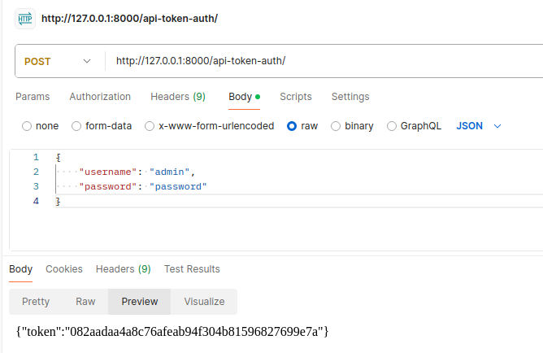
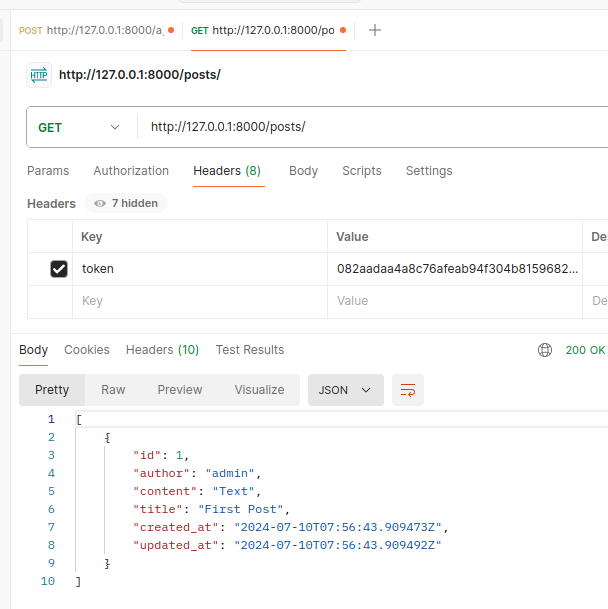
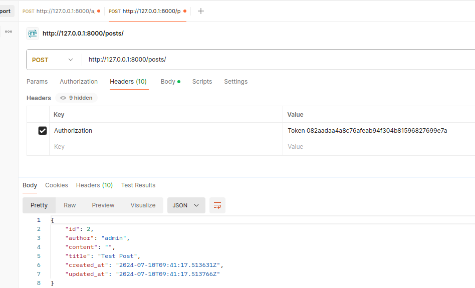
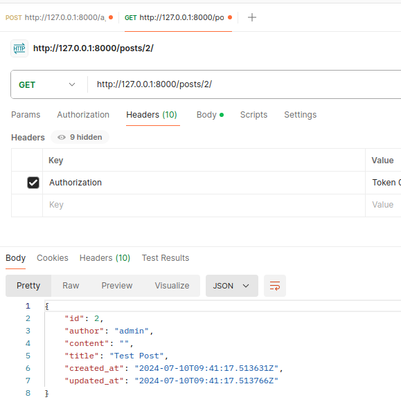
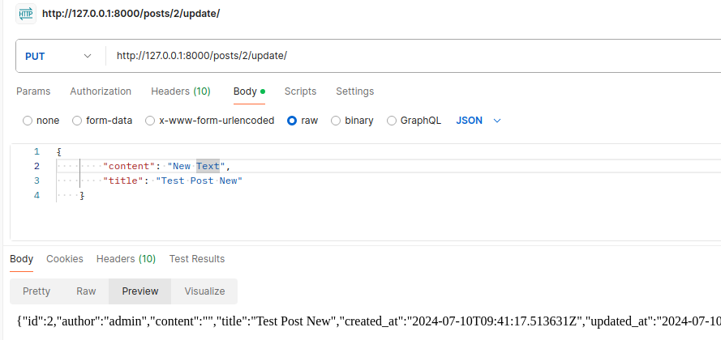
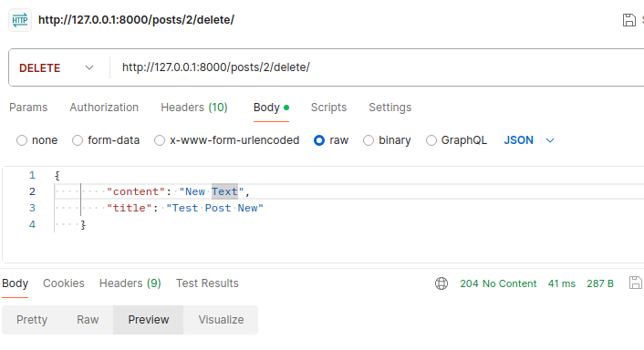

# Blog API

This is a simple Blog API built with Django and Django REST Framework. It allows users to create, read, update, and delete blog posts and comments. It also includes token-based authentication.

## Prerequisites

- Python 3.x
- Django 3.x or later
- Django REST Framework
- Django REST Framework Auth Token

## Setup

1. **Clone the repository:**
    ```bash
    git clone https://github.com/DCI-E08-C/api-group-project-jul-10-team_2
    cd api-group-project-jul-10-team_2
    ```

2. **Create and activate a virtual environment:**
    ```bash
    python -m venv env
    source env/bin/activate  # On Windows, use `env\Scripts\activate`
    ```

3. **Install dependencies:**
    ```bash
    pip install -r requirements.txt
    ```

4. **Apply migrations:**
    ```bash
    python manage.py migrate
    ```

5. **Create a superuser (admin user):**
    ```bash
    python manage.py createsuperuser
    ```

6. **Run the development server:**
    ```bash
    python manage.py runserver
    ```

## API Endpoints

### Authentication

- **Obtain Auth Token:**
  - URL: `/api-token-auth/`
  - Method: `POST`
  - Description: Obtain an authentication token by providing username and password.
  - Request Body:
    ```json
    {
      "username": "your_username",
      "password": "your_password"
    }
    ```
  - Response:
    ```json
    {
      "token": "your_token"
    }
    ```

### Posts

- **List and Create Posts:**
  - URL: `/posts/`
  - Method: `GET` (List), `POST` (Create)
  - Description: Retrieve a list of posts or create a new post.
  - Request Body (Create):
    ```json
    {
      "title": "Post Title",
      "content": "Post Content"
    }
    ```
  - Response (List):
    ```json
    [
      {
        "id": 1,
        "title": "Post Title",
        "content": "Post Content",
        "author": 1,
        "created_at": "2023-07-11T12:00:00Z",
        "updated_at": "2023-07-11T12:00:00Z"
      },
      ...
    ]
    ```


  - Response (Create):
    ```json
    {
      "id": 1,
      "title": "Post Title",
      "content": "Post Content",
      "author": 1,
      "created_at": "2023-07-11T12:00:00Z",
      "updated_at": "2023-07-11T12:00:00Z"
    }
    ```

- **Retrieve, Update, and Delete Post:**
  - URL: `/posts/<int:pk>/`
  - Method: `GET` (Retrieve), `PUT` (Update), `DELETE` (Delete)
  - Description: Retrieve, update, or delete a specific post by its ID.
  - Request Body (Update):
    ```json
    {
      "title": "Updated Title",
      "content": "Updated Content"
    }
    ```
  - Response (Retrieve, Update):
    ```json
    {
      "id": 1,
      "title": "Updated Title",
      "content": "Updated Content",
      "author": 1,
      "created_at": "2023-07-11T12:00:00Z",
      "updated_at": "2023-07-11T12:00:00Z"
    }
    ```



### Comments

- **List and Create Comments:**
  - URL: `/posts/<int:post_pk>/comments/`
  - Method: `GET` (List), `POST` (Create)
  - Description: Retrieve a list of comments for a specific post or create a new comment.
  - Request Body (Create):
    ```json
    {
      "content": "Comment Content"
    }
    ```
  - Response (List):
    ```json
    [
      {
        "id": 1,
        "post": 1,
        "author": 1,
        "content": "Comment Content",
        "created_at": "2023-07-11T12:00:00Z"
      },
      ...
    ]
    ```
  - Response (Create):
    ```json
    {
      "id": 1,
      "post": 1,
      "author": 1,
      "content": "Comment Content",
      "created_at": "2023-07-11T12:00:00Z"
    }
    ```

- **Retrieve, Update, and Delete Comment:**
  - URL: `/posts/<int:post_pk>/comments/<int:pk>/`
  - Method: `GET` (Retrieve), `PUT` (Update), `DELETE` (Delete)
  - Description: Retrieve, update, or delete a specific comment by its ID.
  - Request Body (Update):
    ```json
    {
      "content": "Updated Comment Content"
    }
    ```
  - Response (Retrieve, Update):
    ```json
    {
      "id": 1,
      "post": 1,
      "author": 1,
      "content": "Updated Comment Content",
      "created_at": "2023-07-11T12:00:00Z"
    }
    ```

## Permissions

- The API uses custom permissions (`IsOwnerOrReadOnly`) to ensure that only the owner of a post or comment can update or delete it.
- Other users can only read the posts and comments.

## Authentication

- The API uses token-based authentication. You must include the token in the `Authorization` header in your requests.
  - Example:
    ```http
    Authorization: Token your_token
    ```

## Models

- **Post:**
  - `title`: Title of the post
  - `content`: Content of the post
  - `author`: User who created the post
  - `created_at`: Timestamp when the post was created
  - `updated_at`: Timestamp when the post was last updated

- **Comment:**
  - `post`: The post the comment is related to
  - `author`: User who created the comment
  - `content`: Content of the comment
  - `created_at`: Timestamp when the comment was created
